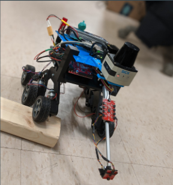

# Wilbur

Wilbur is an autonomous sensor protection robot developed for the Northeastern University ECE Capstone Desgin Competition in the Summer/Fall 2019 semesters. Originally designed with applications for mine detection in mind, Wilbur was designed to autonomously traverse geographically bounded areas and create a map of its environment using OpenSlam's gmapping SLAM algorithm. Additionally, a closed-loop retracting actuator on its front helped ensure that fragile, sensitive sensors placed on the Wilbur platform never came in contact with the ground. Wilbur was a fantastic learning experience, where I was able to hone skills in ROS, sensor integration, robot localization and mapping, as well as interface with a 2D LiDAR unit donated by SICK sensors. Ultimately, Wilbur took 2nd place in the Fall 2019 ECE Capstone competition!
